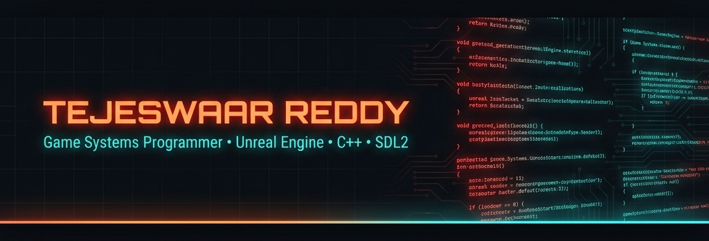

<div align="center">



</div>

<div align="center">

[](https://git.io/typing-svg)

</div>

<div align="center">

[](https://tejeswaar.me)
[](https://github.com/Tejeswaar)
[](https://www.artstation.com)
[](mailto:tejeswaarreddy@gmail.com)

</div>

---

## 👾 About Me

```cpp
class TejeswaarReddy : public GameDeveloper {
public:
    std::string location    = "Hyderabad, India 🇮🇳";
    std::string role        = "Game Systems Programmer & Technical Artist";
    std::string focus[]     = {"Unreal Engine 5 (GAS)", "Custom Engine Dev", "ECS Architecture"};
    std::string shipped     = "MixMash — 10,000+ downloads on Google Play 🎮";

    void current() {
        build("Retina Engine");      // Custom 2D engine in C++ / SDL2
        develop("Land of Souls");    // Dark-fantasy RPG in UE5
        learn("Data-Oriented Design & ECS");
        playing("Elden Ring: Nightreign");
    }
};
```

> 🔥 **Specializing** in gameplay systems, engine architecture, low-level graphics programming and real-time rendering. Experienced in Unreal Engine 5 (GAS & Blueprints), Unity, SDL2 & Cocos Creator.

---

## 🛠️ Tech Stack

<div align="center">

### 💻 Languages


### 🎮 Game Engines & Frameworks


### 🎨 Creative Tools


### 🌐 Web & Tools


</div>

## 📊 GitHub Stats & Metrics

<!-- These SVGs are auto-generated daily by GitHub Actions using lowlighter/metrics -->
<!-- They will appear after the workflow runs -->

<div align="center">
  
</div>

<br/>

<div align="center">
  
</div>

<br/>

<div align="center">
  
</div>

---

## 🏰 Featured Projects

<div align="center">

<table>
  <tr>
    <td width="50%">
      <h3 align="center">🏰 Land of Souls</h3>
      <div align="center">
        <a href="https://github.com/Tejeswaar/Land-of-Souls">
          
        </a>
        <p>Dark-fantasy action RPG built in Unreal Engine 5, leveraging the Gameplay Ability System (GAS) for modular combat, stamina mechanics, combo logic, and deep attribute management.</p>
        <p>
          
          
          
          
        </p>
      </div>
    </td>
    <td width="50%">
      <h3 align="center">🔧 Retina Engine</h3>
      <div align="center">
        <a href="https://github.com/Tejeswaar/RetinaEngine">
          
        </a>
        <p>Custom 2D game engine built from scratch with C++ and SDL2. Features a full ECS architecture, custom rendering pipeline, Dear ImGui integration, and input abstraction layer.</p>
        <p>
          
          
          
          
        </p>
      </div>
    </td>
  </tr>
  <tr>
    <td width="50%">
      <h3 align="center">🧩 Mix Mash</h3>
      <div align="center">
        <a href="https://play.google.com/store/apps/details?id=com.setkeygames.mixmash">
          
        </a>
        <p>Physics-based merge puzzle game shipped to Google Play. Engineered the core gameplay loop, economy, shop system, monetization integrations & event-driven audio system end-to-end.</p>
        <p>
          
          
          
          
        </p>
      </div>
    </td>
    <td width="50%">
      <h3 align="center">📋 QuestBoard</h3>
      <div align="center">
        <a href="https://studio--questboard-89q6g.us-central1.hosted.app/">
          
        </a>
        <p>Full-stack, AI-assisted tool for indie game developers to manage GDDs, questlines, lore, and 3D asset pipelines. Integrated with Gemini AI as a co-designer.</p>
        <p>
          
          
          
          
        </p>
      </div>
    </td>
  </tr>
</table>

</div>

---

## 🎓 Background

<div align="center">

| 🏢 Experience | 📅 Period | 🎯 Role |
|:---|:---:|:---|
| **IACG Multimedia** | 2026–Present | Jr. Game Developer |
| **Tharros Game Studio** | 2025–2026 | Game Systems Programmer (Volunteer) |

| 🎓 Education | 📅 Period |
|:---|:---:|
| **IACG Multimedia College – TS** | 2022–2026 |
| BA (Hons) Multimedia – Gaming | |

</div>

---

## 🌟 Expertise

<div align="center">

```
Game Engines ─────────────────────── Unreal Engine 5 (GAS & Blueprints), Unity
Graphics & Engine ────────────────── SDL2, GLM, ECS, Low-Level Rendering  
Gameplay Systems ─────────────────── Combat, Economy, Input, State Machines
UI & Audio ───────────────────────── HUD, Menus, SFX, Event-Driven Audio
3D Production ────────────────────── Blender, Maya, Substance Painter
Optimization ─────────────────────── Performance Profiling, Asset Optimization
```

</div>

---

## 📫 Let's Connect!

<div align="center">

I'm always open to interesting projects, game dev collaborations, or just a great conversation about systems programming!

[](https://tejeswaar.me)
[](mailto:tejeswaarreddy@gmail.com)
[](https://linkedin.com/in/tejeswaar)

</div>

---

<div align="center">


*"The best game engine is the one you build yourself."* 🎮

</div>
